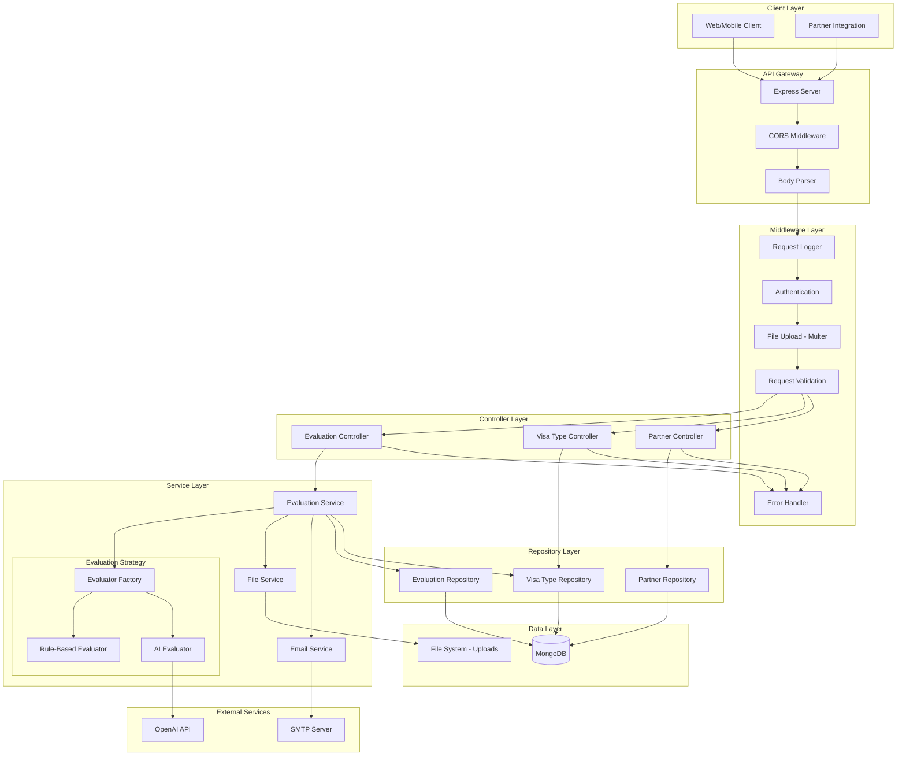
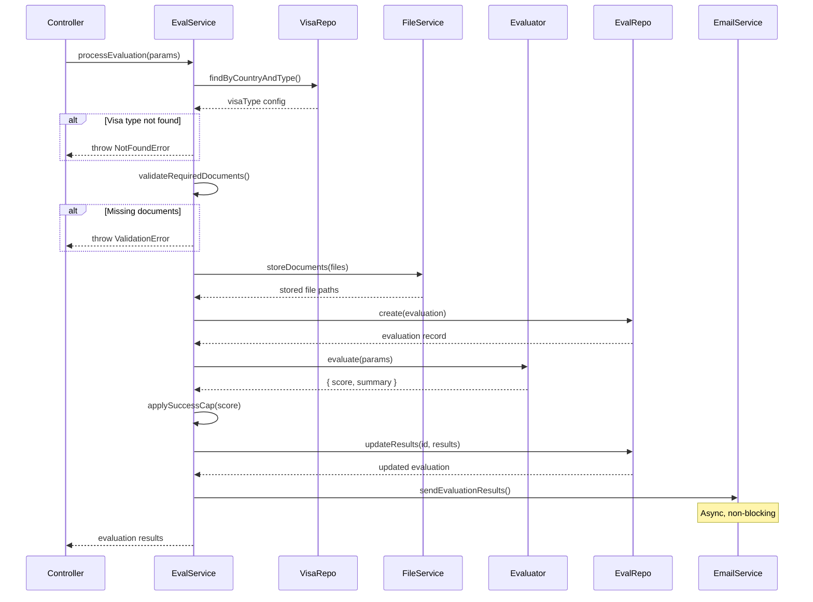
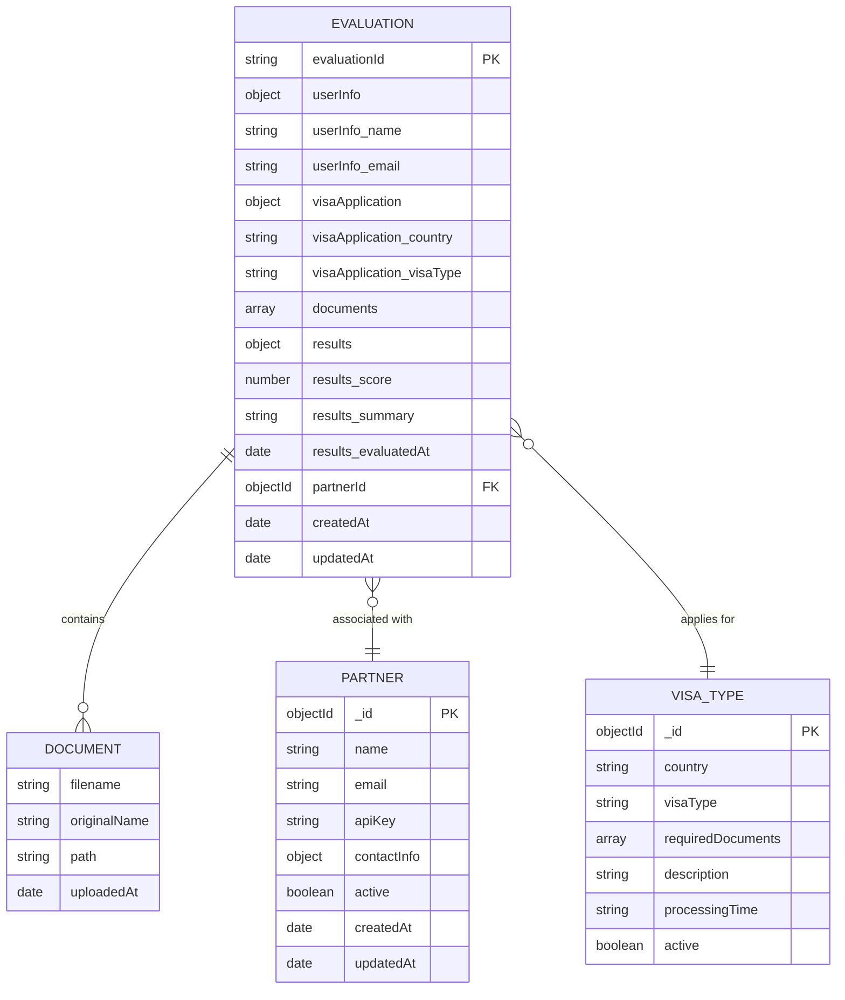
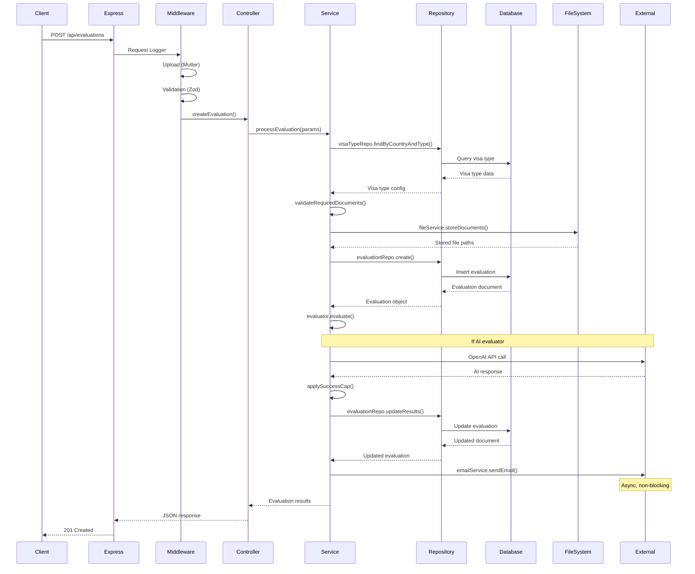
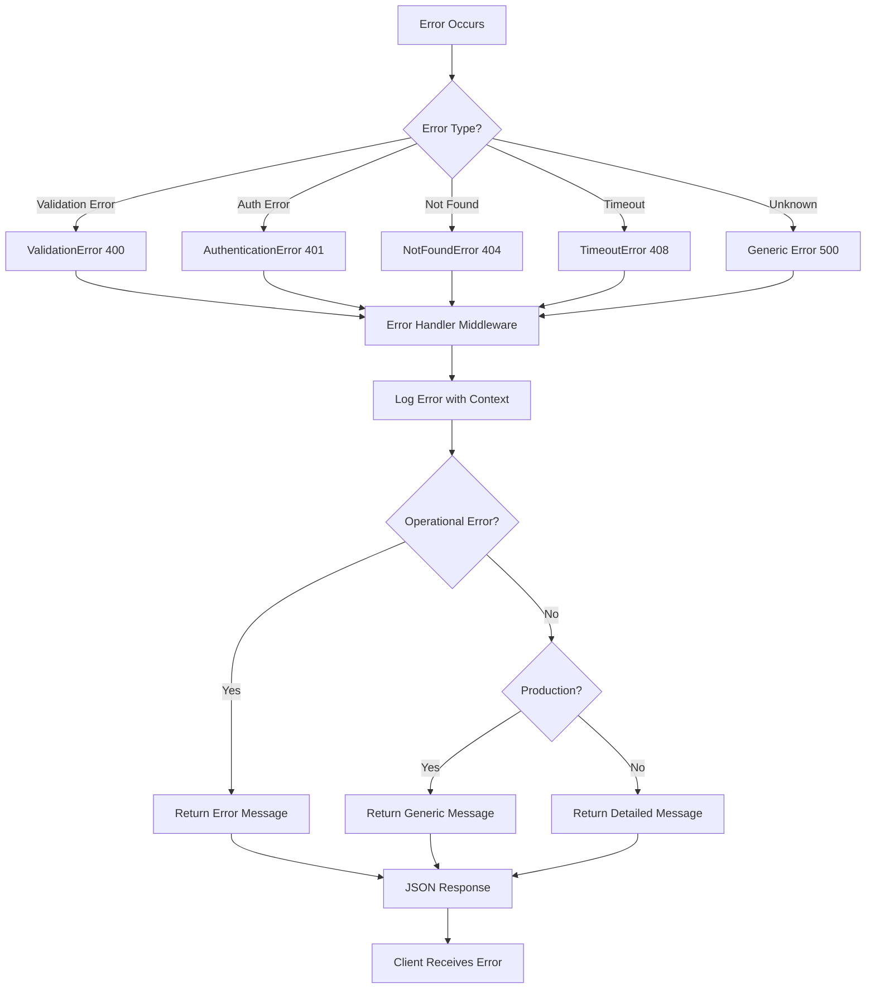
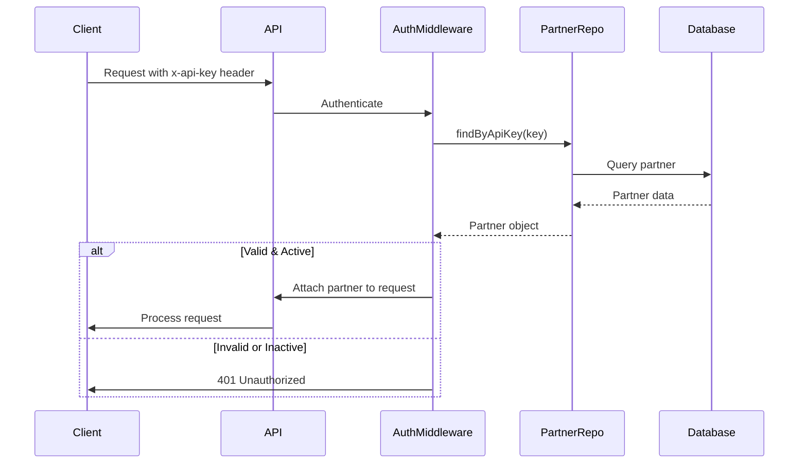

# Architecture Documentation

## Overview

The Visa Evaluation Backend is built using a layered architecture pattern that promotes separation of concerns, maintainability, and testability. The system follows the principle of dependency injection and uses the strategy pattern for evaluation logic, allowing flexible switching between rule-based and AI-powered evaluation methods.

## Architectural Principles

### 1. Layered Architecture

The application is organized into distinct layers, each with specific responsibilities:

- **Routes Layer**: HTTP endpoint definitions and routing
- **Middleware Layer**: Request processing, authentication, validation, error handling
- **Controller Layer**: Request/response handling and coordination
- **Service Layer**: Business logic and orchestration
- **Repository Layer**: Data access abstraction
- **Model Layer**: Data structures and database schemas

### 2. Separation of Concerns

Each layer has a single, well-defined responsibility:
- Routes define API endpoints
- Controllers handle HTTP concerns
- Services implement business logic
- Repositories manage data persistence
- Models define data structures

### 3. Dependency Injection

Services receive their dependencies through constructor injection, making the code:
- Testable (easy to mock dependencies)
- Flexible (easy to swap implementations)
- Maintainable (clear dependency relationships)

### 4. Strategy Pattern

The evaluation logic uses the strategy pattern, allowing runtime selection between:
- Rule-based evaluator (deterministic scoring)
- AI-based evaluator (OpenAI integration)

## System Architecture Diagram




## Layer Details

### Routes Layer

**Location**: `src/routes/`

**Responsibility**: Define API endpoints and map them to controller methods.

**Key Files**:
- `index.ts`: Aggregates all routes and exports combined router
- `evaluations.ts`: Evaluation endpoints with file upload middleware
- `visaTypes.ts`: Visa type query endpoints
- `partners.ts`: Partner management endpoints

**Example**:
```typescript
// src/routes/evaluations.ts
import { Router } from 'express'
import { upload } from '../middleware/upload'
import { authenticatePartner } from '../middleware/auth'
import * as controller from '../controllers/evaluationController'

const router = Router()

router.post('/', upload.array('documents'), controller.createEvaluation)
router.get('/:id', controller.getEvaluation)
router.get('/', authenticatePartner, controller.listEvaluations)

export default router
```

**Design Decisions**:
- Routes are organized by resource (evaluations, visa types, partners)
- Middleware is applied at route level for fine-grained control
- Authentication is optional for public endpoints, required for partner-specific endpoints

---

### Middleware Layer

**Location**: `src/middleware/`

**Responsibility**: Process requests before they reach controllers, handle cross-cutting concerns.

#### Request Logger (`requestLogger.ts`)

**Purpose**: Log all incoming requests and responses for monitoring and debugging.

**Implementation**:
```typescript
export function requestLogger(req: Request, res: Response, next: NextFunction) {
  const requestId = uuidv4()
  req.id = requestId
  
  logger.info('Incoming request', {
    requestId,
    method: req.method,
    path: req.path,
    ip: req.ip
  })
  
  const start = Date.now()
  res.on('finish', () => {
    logger.info('Request completed', {
      requestId,
      statusCode: res.statusCode,
      duration: Date.now() - start
    })
  })
  
  next()
}
```

**Features**:
- Generates unique request ID for tracing
- Logs request method, path, and IP
- Logs response status and duration
- Attaches request ID to request object

#### Authentication (`auth.ts`)

**Purpose**: Validate partner API keys and attach partner data to request.

**Flow**:
1. Extract `x-api-key` from request headers
2. Query Partner repository for matching active key
3. If valid, attach partner object to `req.partner`
4. If invalid or missing, return 401 error

**Implementation**:
```typescript
export async function authenticatePartner(
  req: Request,
  res: Response,
  next: NextFunction
) {
  const apiKey = req.headers['x-api-key'] as string
  
  if (!apiKey) {
    throw new AuthenticationError('API key is required')
  }
  
  const partner = await partnerRepository.findByApiKey(apiKey)
  
  if (!partner || !partner.active) {
    throw new AuthenticationError('Invalid or inactive API key')
  }
  
  req.partner = partner
  next()
}
```

**Type Extension**:
```typescript
// src/types/express.d.ts
declare global {
  namespace Express {
    interface Request {
      partner?: IPartner
      id?: string
    }
  }
}
```


#### File Upload (`upload.ts`)

**Purpose**: Handle multipart/form-data file uploads using Multer.

**Configuration**:
```typescript
import multer from 'multer'

const storage = multer.memoryStorage()

const fileFilter = (req: any, file: Express.Multer.File, cb: any) => {
  const allowedTypes = [
    'application/pdf',
    'application/msword',
    'application/vnd.openxmlformats-officedocument.wordprocessingml.document',
    'image/jpeg',
    'image/png'
  ]
  
  if (allowedTypes.includes(file.mimetype)) {
    cb(null, true)
  } else {
    cb(new ValidationError('Invalid file type'), false)
  }
}

export const upload = multer({
  storage,
  fileFilter,
  limits: {
    fileSize: 5 * 1024 * 1024 // 5MB
  }
})
```

**Features**:
- Memory storage for processing before saving
- File type validation (PDF, DOC, DOCX, JPG, PNG)
- 5MB per file size limit
- Automatic error handling for oversized files

#### Validation (`validation.ts`)

**Purpose**: Validate request data using Zod schemas.

**Implementation**:
```typescript
import { z } from 'zod'

export const createEvaluationSchema = z.object({
  name: z.string().min(1, 'Name is required'),
  email: z.string().email('Invalid email format'),
  country: z.string().min(1, 'Country is required'),
  visaType: z.string().min(1, 'Visa type is required')
})

export function validateRequest(schema: z.ZodSchema) {
  return (req: Request, res: Response, next: NextFunction) => {
    try {
      schema.parse(req.body)
      next()
    } catch (error) {
      if (error instanceof z.ZodError) {
        throw new ValidationError(error.errors)
      }
      throw error
    }
  }
}
```

**Usage**:
```typescript
router.post('/', validateRequest(createEvaluationSchema), controller.create)
```

#### Error Handler (`errorHandler.ts`)

**Purpose**: Catch and format all errors into consistent API responses.

**Flow**:
1. Catch errors from any layer
2. Log error with context
3. Determine if error is operational (expected) or programming error
4. Format appropriate response
5. Hide sensitive details in production

**Implementation**:
```typescript
export function errorHandler(
  err: Error | AppError,
  req: Request,
  res: Response,
  next: NextFunction
) {
  logger.error('Error occurred', {
    error: err.message,
    stack: err.stack,
    requestId: req.id,
    path: req.path
  })
  
  if (err instanceof AppError && err.isOperational) {
    return res.status(err.statusCode).json({
      status: 'error',
      message: err.message
    })
  }
  
  // Unknown/programming errors
  res.status(500).json({
    status: 'error',
    message: process.env.NODE_ENV === 'production' 
      ? 'Internal server error' 
      : err.message
  })
}
```

---

### Controller Layer

**Location**: `src/controllers/`

**Responsibility**: Handle HTTP requests, extract data, call services, format responses.

**Key Principles**:
- Controllers should be thin - delegate business logic to services
- Handle HTTP-specific concerns (status codes, headers)
- Extract and validate request data
- Format responses using standard structure

#### Evaluation Controller

**File**: `src/controllers/evaluationController.ts`

**Methods**:

1. **createEvaluation**: Handle POST /api/evaluations
   - Extract form data and files
   - Extract partner ID from authenticated request (if present)
   - Call EvaluationService.processEvaluation
   - Return 201 with evaluation results

2. **getEvaluation**: Handle GET /api/evaluations/:id
   - Extract evaluation ID from params
   - Call EvaluationService.getEvaluationById
   - Return 200 with evaluation data

3. **listEvaluations**: Handle GET /api/evaluations
   - Extract pagination params
   - Extract partner ID from authenticated request
   - Call EvaluationService.listEvaluations
   - Return 200 with paginated results

**Example**:
```typescript
export async function createEvaluation(
  req: Request,
  res: Response,
  next: NextFunction
) {
  try {
    const { name, email, country, visaType } = req.body
    const documents = req.files as Express.Multer.File[]
    const partnerId = req.partner?._id
    
    const result = await evaluationService.processEvaluation({
      name,
      email,
      country,
      visaType,
      documents,
      partnerId
    })
    
    res.status(201).json({
      status: 'success',
      data: result
    })
  } catch (error) {
    next(error)
  }
}
```


---

### Service Layer

**Location**: `src/services/`

**Responsibility**: Implement business logic, orchestrate operations, coordinate between repositories.

**Key Principles**:
- Services contain all business logic
- Services are framework-agnostic (no Express dependencies)
- Services coordinate multiple repositories and external services
- Services throw domain-specific errors

#### Evaluation Service

**File**: `src/services/evaluationService.ts`

**Dependencies**:
- IEvaluator (strategy interface)
- FileService
- EmailService
- EvaluationRepository
- VisaTypeRepository

**Core Method: processEvaluation**

**Workflow**:


**Implementation Highlights**:
```typescript
export class EvaluationService {
  constructor(
    private evaluator: IEvaluator,
    private fileService: FileService,
    private emailService: EmailService,
    private evaluationRepository: EvaluationRepository,
    private visaTypeRepository: VisaTypeRepository
  ) {}
  
  async processEvaluation(params: ProcessEvaluationParams): Promise<EvaluationResult> {
    // 1. Validate visa type exists
    const visaType = await this.visaTypeRepository.findByCountryAndType(
      params.country,
      params.visaType
    )
    
    if (!visaType) {
      throw new NotFoundError(`Visa type '${params.visaType}' not found for country '${params.country}'`)
    }
    
    // 2. Validate required documents
    this.validateRequiredDocuments(params.documents, visaType.requiredDocuments)
    
    // 3. Store documents
    const storedFiles = await this.fileService.storeDocuments(params.documents)
    
    // 4. Create evaluation record
    const evaluation = await this.evaluationRepository.create({
      userInfo: { name: params.name, email: params.email },
      visaApplication: { country: params.country, visaType: params.visaType },
      documents: storedFiles,
      partnerId: params.partnerId
    })
    
    // 5. Generate evaluation score
    const { score, summary } = await this.evaluator.evaluate({
      country: params.country,
      visaType: params.visaType,
      documents: storedFiles,
      userInfo: { name: params.name, email: params.email }
    })
    
    // 6. Apply success cap
    const cappedScore = this.applySuccessCap(score)
    
    // 7. Update evaluation with results
    const updatedEvaluation = await this.evaluationRepository.updateResults(
      evaluation.evaluationId,
      { score: cappedScore, summary }
    )
    
    // 8. Send email notification (non-blocking)
    this.emailService.sendEvaluationResults({
      email: params.email,
      name: params.name,
      score: cappedScore,
      summary,
      evaluationId: evaluation.evaluationId
    }).catch(err => {
      logger.error('Email send failed', { error: err, email: params.email })
    })
    
    return updatedEvaluation
  }
  
  private applySuccessCap(score: number): number {
    const cap = Number(process.env.SUCCESS_CAP) || 85
    return Math.min(score, cap)
  }
  
  private validateRequiredDocuments(
    submitted: Express.Multer.File[],
    required: string[]
  ): void {
    // Validation logic
  }
}
```

#### File Service

**File**: `src/services/fileService.ts`

**Responsibilities**:
- Store uploaded files with unique names
- Retrieve files by path
- Manage upload directory

**Key Methods**:
```typescript
export class FileService {
  async storeDocuments(files: Express.Multer.File[]): Promise<StoredFile[]> {
    const storedFiles: StoredFile[] = []
    
    for (const file of files) {
      const filename = `${Date.now()}-${file.originalname}`
      const filePath = path.join(this.uploadDir, filename)
      
      await fs.writeFile(filePath, file.buffer)
      
      storedFiles.push({
        filename,
        path: filePath,
        originalName: file.originalname
      })
    }
    
    return storedFiles
  }
}
```

**Design Decisions**:
- Use timestamp prefix to ensure unique filenames
- Store files synchronously during evaluation (ensures atomicity)
- Preserve original filename in metadata
- Future: Migrate to cloud storage (S3) for scalability


#### Email Service

**File**: `src/services/emailService.ts`

**Responsibilities**:
- Send evaluation results via email
- Generate HTML email templates
- Handle SMTP configuration

**Key Features**:
- Non-blocking (errors logged but don't fail evaluation)
- Configurable via environment variables
- Can be disabled with SMTP_ENABLED flag

**Implementation**:
```typescript
export class EmailService {
  private transporter: Transporter
  
  constructor() {
    this.transporter = nodemailer.createTransport({
      host: process.env.SMTP_HOST,
      port: Number(process.env.SMTP_PORT),
      secure: true,
      auth: {
        user: process.env.SMTP_USER,
        pass: process.env.SMTP_PASS
      }
    })
  }
  
  async sendEvaluationResults(params: EmailParams): Promise<void> {
    if (process.env.SMTP_ENABLED !== 'true') {
      return
    }
    
    try {
      await this.transporter.sendMail({
        from: process.env.SMTP_FROM,
        to: params.email,
        subject: 'Your Visa Evaluation Results',
        html: this.generateEmailTemplate(params)
      })
    } catch (error) {
      logger.error('Email send failed', { error, email: params.email })
      // Don't throw - email is optional
    }
  }
}
```

---

### Evaluation Strategy Pattern

**Location**: `src/services/evaluators/`

**Purpose**: Allow flexible switching between evaluation algorithms.

**Components**:

#### 1. Evaluator Interface

**File**: `evaluatorInterface.ts`

```typescript
export interface EvaluateParams {
  country: string
  visaType: string
  documents: Array<{ filename: string; path: string }>
  userInfo: { name: string; email: string }
}

export interface EvaluationResult {
  score: number
  summary: string
}

export interface IEvaluator {
  evaluate(params: EvaluateParams): Promise<EvaluationResult>
}
```

#### 2. Rule-Based Evaluator

**File**: `ruleBasedEvaluator.ts`

**Algorithm**:
```typescript
export class RuleBasedEvaluator implements IEvaluator {
  async evaluate(params: EvaluateParams): Promise<EvaluationResult> {
    let score = 50 // Base score
    
    // Add points for each document (10 points each)
    score += params.documents.length * 10
    
    // Country-specific bonuses
    if (params.country === 'United States' && params.visaType === 'O-1A') {
      score += 15
    } else if (params.country === 'Ireland') {
      score += 10
    }
    
    // Cap at 100
    score = Math.min(score, 100)
    
    const summary = this.generateSummary(score, params)
    
    return { score, summary }
  }
  
  private generateSummary(score: number, params: EvaluateParams): string {
    // Generate human-readable summary based on score and documents
  }
}
```

**Characteristics**:
- Deterministic (same input = same output)
- Fast (no external API calls)
- Transparent (rules are visible)
- Good for testing and development

#### 3. AI Evaluator

**File**: `aiEvaluator.ts`

**Algorithm**:
```typescript
export class AIEvaluator implements IEvaluator {
  private openai: OpenAI
  
  constructor() {
    this.openai = new OpenAI({
      apiKey: process.env.OPENAI_API_KEY
    })
  }
  
  async evaluate(params: EvaluateParams): Promise<EvaluationResult> {
    const prompt = this.buildPrompt(params)
    
    const response = await this.openai.chat.completions.create({
      model: process.env.AI_MODEL || 'gpt-4',
      messages: [
        {
          role: 'system',
          content: 'You are an immigration expert evaluating visa applications.'
        },
        {
          role: 'user',
          content: prompt
        }
      ],
      temperature: 0.7
    })
    
    return this.parseAIResponse(response)
  }
  
  private buildPrompt(params: EvaluateParams): string {
    return `Evaluate this visa application:
    Country: ${params.country}
    Visa Type: ${params.visaType}
    Documents: ${params.documents.map(d => d.filename).join(', ')}
    
    Provide:
    1. A score from 0-100
    2. A brief summary with recommendations
    
    Format: SCORE: [number] SUMMARY: [text]`
  }
  
  private parseAIResponse(response: any): EvaluationResult {
    // Parse AI response to extract score and summary
  }
}
```

**Characteristics**:
- Intelligent (considers context and nuance)
- Slower (external API call)
- Requires API key and credits
- Better quality evaluations

#### 4. Evaluator Factory

**File**: `evaluatorFactory.ts`

**Purpose**: Create appropriate evaluator based on configuration.

```typescript
export function createEvaluator(): IEvaluator {
  const type = process.env.EVALUATOR_TYPE || 'rule-based'
  
  switch (type) {
    case 'ai':
      if (!process.env.OPENAI_API_KEY) {
        throw new Error('OPENAI_API_KEY required for AI evaluator')
      }
      return new AIEvaluator()
    
    case 'rule-based':
    default:
      return new RuleBasedEvaluator()
  }
}
```

**Usage in Service**:
```typescript
// In server.ts or dependency injection setup
const evaluator = createEvaluator()
const evaluationService = new EvaluationService(
  evaluator,
  fileService,
  emailService,
  evaluationRepository,
  visaTypeRepository
)
```


---

### Repository Layer

**Location**: `src/repositories/`

**Responsibility**: Abstract data access, provide type-safe database operations.

**Key Principles**:
- Repositories hide database implementation details
- Provide domain-focused methods (not just CRUD)
- Return domain objects, not database documents
- Handle database errors and convert to domain errors

#### Evaluation Repository

**File**: `src/repositories/evaluationRepository.ts`

**Methods**:
```typescript
export class EvaluationRepository {
  async create(data: CreateEvaluationData): Promise<IEvaluation> {
    const evaluation = new Evaluation(data)
    return await evaluation.save()
  }
  
  async findById(evaluationId: string): Promise<IEvaluation | null> {
    return await Evaluation.findOne({ evaluationId })
  }
  
  async findByEmail(email: string): Promise<IEvaluation[]> {
    return await Evaluation.find({ 'userInfo.email': email })
      .sort({ createdAt: -1 })
  }
  
  async findByPartnerId(
    partnerId: string,
    options: PaginationOptions
  ): Promise<PaginatedResult<IEvaluation>> {
    const { page = 1, limit = 20 } = options
    const skip = (page - 1) * limit
    
    const [evaluations, total] = await Promise.all([
      Evaluation.find({ partnerId })
        .sort({ createdAt: -1 })
        .skip(skip)
        .limit(limit),
      Evaluation.countDocuments({ partnerId })
    ])
    
    return {
      data: evaluations,
      pagination: {
        page,
        limit,
        total,
        pages: Math.ceil(total / limit)
      }
    }
  }
  
  async updateResults(
    evaluationId: string,
    results: { score: number; summary: string }
  ): Promise<IEvaluation> {
    const evaluation = await Evaluation.findOneAndUpdate(
      { evaluationId },
      {
        results: {
          ...results,
          evaluatedAt: new Date()
        },
        updatedAt: new Date()
      },
      { new: true }
    )
    
    if (!evaluation) {
      throw new NotFoundError('Evaluation')
    }
    
    return evaluation
  }
}
```

**Design Decisions**:
- Use evaluationId (UUID) for public API, not MongoDB _id
- Implement pagination at repository level
- Return null for not found (let service decide error handling)
- Use lean() queries when full Mongoose document not needed

#### Partner Repository

**File**: `src/repositories/partnerRepository.ts`

**Key Methods**:
```typescript
export class PartnerRepository {
  async create(data: CreatePartnerData): Promise<IPartner> {
    const apiKey = crypto.randomBytes(32).toString('hex')
    const partner = new Partner({ ...data, apiKey })
    return await partner.save()
  }
  
  async findByApiKey(apiKey: string): Promise<IPartner | null> {
    return await Partner.findOne({ apiKey, active: true })
  }
  
  async updateStatus(partnerId: string, active: boolean): Promise<IPartner> {
    const partner = await Partner.findByIdAndUpdate(
      partnerId,
      { active, updatedAt: new Date() },
      { new: true }
    )
    
    if (!partner) {
      throw new NotFoundError('Partner')
    }
    
    return partner
  }
}
```

**Security Note**: API keys are generated using cryptographically secure random bytes.

#### Visa Type Repository

**File**: `src/repositories/visaTypeRepository.ts`

**Key Features**:
- In-memory caching (visa types rarely change)
- Cache invalidation on updates

```typescript
export class VisaTypeRepository {
  private cache: Map<string, IVisaType[]> = new Map()
  
  async findAll(): Promise<IVisaType[]> {
    const cacheKey = 'all'
    
    if (this.cache.has(cacheKey)) {
      return this.cache.get(cacheKey)!
    }
    
    const visaTypes = await VisaType.find({ active: true })
    this.cache.set(cacheKey, visaTypes)
    
    return visaTypes
  }
  
  async findByCountry(country: string): Promise<IVisaType[]> {
    if (this.cache.has(country)) {
      return this.cache.get(country)!
    }
    
    const visaTypes = await VisaType.find({ country, active: true })
    this.cache.set(country, visaTypes)
    
    return visaTypes
  }
  
  async findByCountryAndType(
    country: string,
    visaType: string
  ): Promise<IVisaType | null> {
    return await VisaType.findOne({ country, visaType, active: true })
  }
  
  clearCache(): void {
    this.cache.clear()
  }
}
```

---

### Model Layer

**Location**: `src/models/`

**Responsibility**: Define data structures and database schemas.

#### Database Schema Design



#### Indexes

**Evaluation Collection**:
- `evaluationId`: Unique index for fast lookup
- `userInfo.email`: Index for user query
- `partnerId`: Index for partner queries
- `createdAt`: Index for date-based queries

**Partner Collection**:
- `apiKey`: Unique index for authentication
- `email`: Unique index

**VisaType Collection**:
- `{ country: 1, visaType: 1 }`: Compound unique index
- `country`: Index for country queries

---

## Data Flow

### Complete Evaluation Flow




### Error Handling Flow



**Error Hierarchy**:
```typescript
AppError (Base)
├── ValidationError (400)
├── AuthenticationError (401)
├── NotFoundError (404)
├── TimeoutError (408)
└── InternalError (500)
```

---

## File Storage Strategy

### Current Implementation

**Storage Location**: Local file system (`uploads/` directory)

**Naming Convention**: `{timestamp}-{originalFilename}`

**Example**: `1700220600000-resume.pdf`

**Advantages**:
- Simple implementation
- No external dependencies
- Fast for development
- No additional costs

**Limitations**:
- Not scalable for high traffic
- No redundancy
- Difficult to share across multiple servers
- No built-in backup

### Future: Cloud Storage Migration

**Recommended**: AWS S3 or similar object storage

**Benefits**:
- Scalable and reliable
- Built-in redundancy
- CDN integration
- Automatic backups
- Access from multiple servers

**Migration Path**:
1. Create S3 bucket
2. Update FileService to use AWS SDK
3. Implement presigned URLs for secure access
4. Migrate existing files
5. Update environment configuration

**Example S3 Implementation**:
```typescript
import { S3Client, PutObjectCommand } from '@aws-sdk/client-s3'

export class S3FileService implements IFileService {
  private s3: S3Client
  
  async storeDocuments(files: Express.Multer.File[]): Promise<StoredFile[]> {
    const uploads = files.map(file => {
      const key = `evaluations/${Date.now()}-${file.originalname}`
      
      return this.s3.send(new PutObjectCommand({
        Bucket: process.env.S3_BUCKET,
        Key: key,
        Body: file.buffer,
        ContentType: file.mimetype
      }))
    })
    
    await Promise.all(uploads)
    return storedFiles
  }
}
```

---

## Configuration Management

### Environment-Based Configuration

**Development**:
- Local MongoDB
- File storage in `uploads/`
- Rule-based evaluator
- Debug logging
- CORS allows all origins

**Production**:
- MongoDB Atlas or managed instance
- Cloud storage (S3)
- AI evaluator (optional)
- Error/warn logging only
- CORS restricted to specific domains
- HTTPS required

### Configuration Validation

All environment variables are validated on startup using Zod:

```typescript
const envSchema = z.object({
  PORT: z.string().transform(Number),
  MONGODB_URI: z.string().min(1),
  EVALUATOR_TYPE: z.enum(['rule-based', 'ai']),
  // ... more fields
}).refine(
  (data) => data.EVALUATOR_TYPE !== 'ai' || data.OPENAI_API_KEY,
  { message: 'OPENAI_API_KEY required when using AI evaluator' }
)
```

**Benefits**:
- Fail fast on misconfiguration
- Type-safe configuration access
- Self-documenting requirements
- Cross-field validation

---

## Dependency Injection

### Manual Dependency Injection

The application uses constructor-based dependency injection:

```typescript
// server.ts - Dependency setup
const evaluator = createEvaluator()
const fileService = new FileService(process.env.UPLOAD_DIR)
const emailService = new EmailService()

const evaluationRepository = new EvaluationRepository()
const partnerRepository = new PartnerRepository()
const visaTypeRepository = new VisaTypeRepository()

const evaluationService = new EvaluationService(
  evaluator,
  fileService,
  emailService,
  evaluationRepository,
  visaTypeRepository
)

// Controllers receive services
const evaluationController = createEvaluationController(evaluationService)
```

**Benefits**:
- Testable (easy to inject mocks)
- Flexible (swap implementations)
- Clear dependencies
- No magic (explicit wiring)

### Future: DI Container

For larger applications, consider using a DI container like `tsyringe` or `inversify`:

```typescript
import { container } from 'tsyringe'

container.register('IEvaluator', { useFactory: createEvaluator })
container.register('FileService', { useClass: FileService })
container.register('EvaluationService', { useClass: EvaluationService })

const service = container.resolve(EvaluationService)
```

---

## Security Architecture

### Authentication Flow



### Security Layers

1. **Transport Security**: HTTPS in production (via reverse proxy)
2. **Input Validation**: Zod schemas validate all inputs
3. **File Upload Security**: 
   - File type validation
   - Size limits
   - Unique filenames prevent overwrites
4. **API Key Security**:
   - Cryptographically secure generation
   - Stored in database (future: hash keys)
   - Can be deactivated
5. **CORS**: Restricted to allowed origins
6. **Error Handling**: No sensitive data in error messages
7. **Rate Limiting**: Future enhancement

---

## Performance Considerations

### Database Optimization

**Indexes**:
- All frequently queried fields are indexed
- Compound indexes for multi-field queries
- Unique indexes prevent duplicates

**Query Optimization**:
- Use `lean()` for read-only queries (faster)
- Project only needed fields
- Implement pagination for large result sets

**Connection Pooling**:
- Mongoose manages connection pool automatically
- Default pool size: 5 connections
- Configurable via connection options

### Caching Strategy

**Current**:
- Visa types cached in memory (rarely change)
- Cache invalidation on updates

**Future**:
- Redis for distributed caching
- Cache evaluation results for duplicate requests
- Cache AI responses for similar applications

### Async Processing

**Current**:
- Email sending is non-blocking
- File storage is synchronous (ensures atomicity)

**Future**:
- Job queue (Bull/BullMQ) for evaluation processing
- Webhook notifications instead of polling
- Background jobs for cleanup and maintenance

---

## Scalability Considerations

### Horizontal Scaling

**Current Architecture Supports**:
- Stateless API (no session state)
- Multiple instances behind load balancer
- Shared MongoDB database

**Requirements**:
- Shared file storage (S3 instead of local)
- Shared cache (Redis instead of in-memory)
- Load balancer (Nginx, AWS ALB)

### Vertical Scaling

**Resource Usage**:
- CPU: Moderate (AI evaluator increases usage)
- Memory: Low to moderate (depends on file uploads)
- Disk: Grows with uploaded files
- Network: Moderate (file uploads, AI API calls)

**Scaling Triggers**:
- Response time > 2 seconds
- CPU usage > 70%
- Memory usage > 80%
- Queue depth > 100 requests

### Database Scaling

**Options**:
1. **Vertical**: Increase MongoDB instance size
2. **Horizontal**: MongoDB sharding (for very large datasets)
3. **Read Replicas**: For read-heavy workloads
4. **Managed Service**: MongoDB Atlas auto-scaling

---

## Monitoring and Observability

### Logging Strategy

**Log Levels**:
- **Error**: Application errors, failed operations
- **Warn**: Degraded performance, recoverable errors
- **Info**: Important business events (evaluation created)
- **Debug**: Detailed diagnostic information

**Log Structure**:
```json
{
  "level": "info",
  "message": "Evaluation created",
  "timestamp": "2025-11-17T10:30:00.000Z",
  "requestId": "550e8400-e29b-41d4-a716-446655440000",
  "evaluationId": "abc123",
  "partnerId": "partner-xyz",
  "duration": 1250
}
```

### Health Checks

**Endpoint**: `GET /health`

**Checks**:
- API service status
- MongoDB connection
- Disk space (future)
- External service availability (future)

**Response**:
```json
{
  "status": "healthy",
  "version": "1.0.0",
  "uptime": 3600,
  "database": {
    "status": "connected"
  }
}
```

### Metrics (Future)

**Key Metrics**:
- Request rate (requests/second)
- Response time (p50, p95, p99)
- Error rate (errors/total requests)
- Evaluation success rate
- AI API latency
- Database query time

**Tools**:
- Prometheus for metrics collection
- Grafana for visualization
- AlertManager for alerts

---

## Testing Strategy

### Unit Tests

**Target**: Business logic in services and utilities

**Tools**: Jest

**Example**:
```typescript
describe('EvaluationService', () => {
  it('should apply success cap correctly', () => {
    const service = new EvaluationService(/* mocked dependencies */)
    expect(service['applySuccessCap'](95)).toBe(85)
  })
})
```

### Integration Tests

**Target**: API endpoints with test database

**Tools**: Jest + Supertest + MongoDB Memory Server

**Example**:
```typescript
describe('POST /api/evaluations', () => {
  it('should create evaluation with valid data', async () => {
    const response = await request(app)
      .post('/api/evaluations')
      .field('name', 'John Doe')
      .field('email', 'john@example.com')
      .attach('documents', 'test/fixtures/resume.pdf')
      .expect(201)
    
    expect(response.body.data.score).toBeGreaterThan(0)
  })
})
```

### Contract Tests

**Target**: API response formats

**Ensures**: Consistent API contracts for clients

---

## Future Enhancements

### Microservices Architecture

**Potential Services**:
- **Evaluation Service**: Core evaluation logic
- **Document Service**: File storage and processing
- **Notification Service**: Email, SMS, webhooks
- **Analytics Service**: Reporting and insights
- **Partner Service**: Partner management

**Benefits**:
- Independent scaling
- Technology diversity
- Fault isolation
- Team autonomy

### Event-Driven Architecture

**Event Bus**: RabbitMQ or AWS EventBridge

**Events**:
- `EvaluationCreated`
- `EvaluationCompleted`
- `PartnerCreated`
- `DocumentUploaded`

**Benefits**:
- Loose coupling
- Async processing
- Easy to add new features
- Better scalability

---

## Conclusion

The Visa Evaluation Backend follows a well-structured layered architecture that promotes:

- **Maintainability**: Clear separation of concerns
- **Testability**: Dependency injection and interface-based design
- **Scalability**: Stateless design and horizontal scaling support
- **Flexibility**: Strategy pattern for evaluation logic
- **Security**: Multiple layers of validation and authentication
- **Observability**: Comprehensive logging and health checks

The architecture is designed to evolve from a monolithic application to a distributed system as requirements grow, while maintaining code quality and developer productivity.

---

**Last Updated**: November 17, 2025
