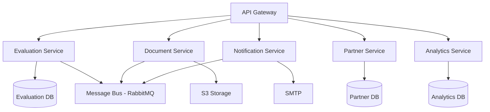

# Future Enhancements

## Overview

This document outlines planned features, improvements, and architectural enhancements for the Visa Evaluation Backend API. These enhancements represent the roadmap for future development beyond the current MVP implementation.

## Priority Levels

- **P0**: Critical - High impact, should be implemented soon
- **P1**: High - Significant value, plan for next quarter
- **P2**: Medium - Nice to have, implement when resources available
- **P3**: Low - Future consideration, low priority

---

## Currently Implemented Features

The following features are already implemented in the current version:
- ✅ Multi-country visa type support (6 countries, 13 visa types)
- ✅ AI-powered evaluation with document parsing (PDF, DOCX, TXT)
- ✅ Partner dashboard with analytics, charts, and CSV export
- ✅ API rate limiting with multiple tiers
- ✅ Weighted category scoring system
- ✅ Email notifications with HTML templates
- ✅ Core testing suite (unit and integration tests)

---

## Feature Enhancements

### 1. Multi-Language Support (P1)

**Description**: Support multiple languages for evaluation summaries and email notifications.

**Benefits**:
- Expand to international markets
- Improve user experience for non-English speakers
- Increase accessibility

**Implementation**:
- Use i18n library (i18next)
- Store translations in JSON files
- Accept `Accept-Language` header
- Translate evaluation summaries
- Localize email templates

**Technical Details**:
```typescript
import i18next from 'i18next'

// Initialize i18n
i18next.init({
  lng: 'en',
  resources: {
    en: { translation: require('./locales/en.json') },
    es: { translation: require('./locales/es.json') },
    fr: { translation: require('./locales/fr.json') }
  }
})

// In service
const summary = i18next.t('evaluation.summary', {
  score,
  country,
  visaType
})
```

**Supported Languages** (Phase 1):
- English
- Spanish
- French
- German
- Polish

---

### 2. Enhanced Partner Dashboard Features (P1)

**Description**: Additional features for the existing partner dashboard.

**Proposed Enhancements**:
- **Advanced Filtering**: Save filter presets, complex query builder
- **Custom Reports**: User-defined report builder with scheduling
- **Data Visualization**: More chart types (heatmaps, funnel charts)
- **Comparison Views**: Compare performance across time periods
- **Bulk Operations**: Bulk export, bulk status updates
- **Dashboard Customization**: Drag-and-drop widget arrangement
- **Mobile App**: Native mobile app for partners

---

### 3. Embed Capability (P1)

**Description**: Allow partners to embed evaluation form on their websites.

**Implementation Options**:

#### Option A: iframe Embed
```html
<iframe 
  src="https://api.yourdomain.com/embed?key=partner-api-key"
  width="100%"
  height="600px"
  frameborder="0">
</iframe>
```

#### Option B: JavaScript Widget
```html
<div id="visa-eval-widget"></div>
<script src="https://api.yourdomain.com/widget.js"></script>
<script>
  VisaEvalWidget.init({
    apiKey: 'partner-api-key',
    container: '#visa-eval-widget',
    theme: 'light'
  })
</script>
```

**Features**:
- Customizable styling (colors, fonts)
- Responsive design
- CORS configuration
- Postmessage communication
- Analytics tracking

---

### 3. Advanced AI Integration Improvements (P1)

**Description**: Enhance AI evaluation with additional capabilities.

**Proposed Enhancements**:

#### OCR for Scanned Documents
- Implement Tesseract.js for OCR
- Extract text from scanned PDFs and images
- Handle handwritten documents
- Improve accuracy with preprocessing

#### Multi-Model Support
- Integrate Anthropic Claude
- Integrate Google Gemini
- Integrate Azure OpenAI
- Model selection based on visa type or document complexity
- A/B testing between models
- Fallback mechanisms

#### Enhanced Document Analysis
```typescript
interface EnhancedAIOutput {
  score: number
  summary: string
  recommendations: string[]
  conclusion: string
  documentAnalysis: {
    [documentType: string]: {
      quality: 'excellent' | 'good' | 'fair' | 'poor'
      completeness: number
      issues: string[]
      suggestions: string[]
    }
  }
  confidenceScore: number
  riskFactors: string[]
}
```

#### Advanced Prompt Engineering
- Few-shot learning examples
- Chain-of-thought reasoning
- Self-consistency checks
- Dynamic prompt generation based on context

---

### 5. Redis Caching for Performance Optimization (P0)

**Description**: Implement Redis for distributed caching and session management.

**Use Cases**:
- Cache visa type configurations
- Cache evaluation results (for duplicate requests)
- Cache AI responses (for similar applications)
- Rate limiting counters
- Session storage (future auth)

**Implementation**:
```typescript
import { createClient } from 'redis'

const redis = createClient({
  url: process.env.REDIS_URL
})

// Cache visa types
async function getVisaTypes(country: string) {
  const cacheKey = `visa-types:${country}`
  const cached = await redis.get(cacheKey)
  
  if (cached) {
    return JSON.parse(cached)
  }
  
  const visaTypes = await visaTypeRepository.findByCountry(country)
  await redis.setEx(cacheKey, 3600, JSON.stringify(visaTypes))
  
  return visaTypes
}
```

**Cache Strategy**:
- TTL: 1 hour for visa types
- TTL: 24 hours for evaluation results
- Cache invalidation on updates
- LRU eviction policy

---

### 6. File Virus Scanning Integration (P0)

**Description**: Scan uploaded files for viruses and malware.

**Implementation Options**:

#### Option A: ClamAV (Open Source)
```bash
# Install ClamAV
sudo apt-get install clamav clamav-daemon

# Update virus definitions
sudo freshclam
```

```typescript
import { NodeClam } from 'clamscan'

const clam = await new NodeClam().init({
  clamdscan: {
    path: '/usr/bin/clamdscan'
  }
})

// Scan file
const { isInfected, viruses } = await clam.scanFile(filePath)

if (isInfected) {
  throw new ValidationError(`File infected: ${viruses.join(', ')}`)
}
```

#### Option B: Cloud Service (VirusTotal, MetaDefender)
```typescript
import axios from 'axios'

async function scanFile(fileBuffer: Buffer) {
  const response = await axios.post(
    'https://www.virustotal.com/api/v3/files',
    fileBuffer,
    {
      headers: {
        'x-apikey': process.env.VIRUSTOTAL_API_KEY
      }
    }
  )
  
  return response.data
}
```

---

### 7. Cloud Storage Migration (AWS S3) (P1)

**Description**: Migrate from local file storage to AWS S3 for scalability and reliability.

**Benefits**:
- Unlimited storage
- High availability
- CDN integration (CloudFront)
- Automatic backups
- Multi-region replication

**Implementation**:
```typescript
import { S3Client, PutObjectCommand, GetObjectCommand } from '@aws-sdk/client-s3'
import { getSignedUrl } from '@aws-sdk/s3-request-presigner'

export class S3FileService implements IFileService {
  private s3: S3Client
  
  constructor() {
    this.s3 = new S3Client({
      region: process.env.AWS_REGION,
      credentials: {
        accessKeyId: process.env.AWS_ACCESS_KEY_ID,
        secretAccessKey: process.env.AWS_SECRET_ACCESS_KEY
      }
    })
  }
  
  async storeDocuments(files: Express.Multer.File[]): Promise<StoredFile[]> {
    const uploads = files.map(async (file) => {
      const key = `evaluations/${Date.now()}-${file.originalname}`
      
      await this.s3.send(new PutObjectCommand({
        Bucket: process.env.S3_BUCKET,
        Key: key,
        Body: file.buffer,
        ContentType: file.mimetype,
        ServerSideEncryption: 'AES256'
      }))
      
      return {
        filename: key,
        path: `s3://${process.env.S3_BUCKET}/${key}`,
        originalName: file.originalname
      }
    })
    
    return Promise.all(uploads)
  }
  
  async getDocumentUrl(key: string): Promise<string> {
    const command = new GetObjectCommand({
      Bucket: process.env.S3_BUCKET,
      Key: key
    })
    
    // Generate presigned URL (valid for 1 hour)
    return getSignedUrl(this.s3, command, { expiresIn: 3600 })
  }
}
```

**Migration Steps**:
1. Create S3 bucket with versioning
2. Configure bucket policies and CORS
3. Implement S3FileService
4. Migrate existing files
5. Update environment configuration
6. Test thoroughly
7. Switch over

---

### 8. Job Queue for Async Evaluation Processing (P1)

**Description**: Use Bull/BullMQ for asynchronous evaluation processing.

**Benefits**:
- Non-blocking API responses
- Retry failed evaluations
- Priority queues
- Scheduled jobs
- Better resource utilization

**Implementation**:
```typescript
import { Queue, Worker } from 'bullmq'

// Create queue
const evaluationQueue = new Queue('evaluations', {
  connection: {
    host: process.env.REDIS_HOST,
    port: Number(process.env.REDIS_PORT)
  }
})

// Add job to queue
async function submitEvaluation(params: EvaluationParams) {
  const job = await evaluationQueue.add('process', params, {
    attempts: 3,
    backoff: {
      type: 'exponential',
      delay: 2000
    }
  })
  
  return { jobId: job.id, status: 'queued' }
}

// Worker to process jobs
const worker = new Worker('evaluations', async (job) => {
  const result = await evaluationService.processEvaluation(job.data)
  return result
}, {
  connection: {
    host: process.env.REDIS_HOST,
    port: Number(process.env.REDIS_PORT)
  }
})

// Check job status
async function getJobStatus(jobId: string) {
  const job = await evaluationQueue.getJob(jobId)
  return {
    status: await job.getState(),
    progress: job.progress,
    result: job.returnvalue
  }
}
```

**API Changes**:
```typescript
// Submit evaluation (returns immediately)
POST /api/evaluations
Response: { jobId: '123', status: 'queued' }

// Check status
GET /api/evaluations/jobs/:jobId
Response: { status: 'completed', result: {...} }
```

---

### 4. Distributed Rate Limiting with Redis (P0)

**Description**: Migrate rate limiting from in-memory to Redis for distributed systems.

**Benefits**:
- Support multiple server instances
- Persistent rate limit counters
- Better performance at scale
- Centralized rate limit management

**Implementation**:
```typescript
import { createClient } from 'redis'
import RedisStore from 'rate-limit-redis'

const redis = createClient({
  url: process.env.REDIS_URL
})

const apiLimiter = rateLimit({
  store: new RedisStore({
    client: redis,
    prefix: 'rl:'
  }),
  windowMs: 15 * 60 * 1000,
  max: 100
})
```

---

### 10. Microservices Architecture (P3)

**Description**: Split monolithic application into microservices.

**Proposed Services**:



**Benefits**:
- Independent scaling
- Technology diversity
- Fault isolation
- Team autonomy
- Easier deployment

**Challenges**:
- Increased complexity
- Distributed transactions
- Service discovery
- Network latency
- Monitoring complexity

**Effort**: 3-6 months

---

### 11. GraphQL API Alternative (P2)

**Description**: Provide GraphQL API alongside REST API.

**Benefits**:
- Flexible queries
- Reduced over-fetching
- Strong typing
- Real-time subscriptions

**Implementation**:
```typescript
import { ApolloServer } from '@apollo/server'
import { expressMiddleware } from '@apollo/server/express4'

const typeDefs = `
  type Evaluation {
    evaluationId: ID!
    userInfo: UserInfo!
    visaApplication: VisaApplication!
    results: EvaluationResults
    createdAt: String!
  }
  
  type Query {
    evaluation(id: ID!): Evaluation
    evaluations(page: Int, limit: Int): EvaluationConnection
    visaTypes(country: String): [VisaType!]!
  }
  
  type Mutation {
    submitEvaluation(input: EvaluationInput!): Evaluation!
  }
  
  type Subscription {
    evaluationUpdated(id: ID!): Evaluation!
  }
`

const resolvers = {
  Query: {
    evaluation: (_, { id }) => evaluationService.getById(id),
    evaluations: (_, { page, limit }) => evaluationService.list(page, limit),
    visaTypes: (_, { country }) => visaTypeService.getByCountry(country)
  },
  Mutation: {
    submitEvaluation: (_, { input }) => evaluationService.process(input)
  }
}

const server = new ApolloServer({ typeDefs, resolvers })
```

---

### 12. Real-Time Notifications via WebSockets (P2)

**Description**: Push real-time updates to clients using WebSockets.

**Use Cases**:
- Evaluation progress updates
- Real-time score calculation
- Partner dashboard live updates
- System notifications

**Implementation**:
```typescript
import { Server } from 'socket.io'

const io = new Server(httpServer, {
  cors: {
    origin: process.env.CORS_ORIGINS.split(',')
  }
})

// Authentication
io.use((socket, next) => {
  const apiKey = socket.handshake.auth.apiKey
  // Validate API key
  next()
})

// Emit evaluation updates
io.to(`evaluation:${evaluationId}`).emit('progress', {
  status: 'processing',
  progress: 50
})

io.to(`evaluation:${evaluationId}`).emit('completed', {
  score: 85,
  summary: '...'
})
```

**Client Usage**:
```javascript
const socket = io('https://api.yourdomain.com', {
  auth: { apiKey: 'partner-key' }
})

socket.on('progress', (data) => {
  console.log('Progress:', data.progress)
})

socket.on('completed', (data) => {
  console.log('Score:', data.score)
})
```

---

### 13. Advanced Analytics and Reporting (P2)

**Description**: Comprehensive analytics and reporting features.

**Features**:
- **Success Rate Analysis**: By country, visa type, time period
- **Document Analysis**: Which documents correlate with higher scores
- **Trend Analysis**: Score trends over time
- **Partner Performance**: Evaluation volume, average scores
- **Predictive Analytics**: ML models to predict approval likelihood
- **Custom Reports**: User-defined report builder
- **Scheduled Reports**: Email reports on schedule

**Technical Stack**:
- Data Warehouse: PostgreSQL or BigQuery
- ETL: Apache Airflow
- Visualization: Metabase or Superset
- ML: Python + scikit-learn

---

### 14. Multi-Factor Authentication for Partners (P1)

**Description**: Add MFA for partner account security.

**Implementation**:
- TOTP (Time-based One-Time Password)
- SMS verification
- Email verification
- Backup codes

**Libraries**:
- speakeasy (TOTP generation)
- qrcode (QR code generation)
- twilio (SMS)

**Flow**:
```typescript
// Enable MFA
POST /api/partners/mfa/enable
Response: { secret, qrCode, backupCodes }

// Verify MFA
POST /api/partners/mfa/verify
Body: { token }

// Login with MFA
POST /api/partners/login
Body: { apiKey, mfaToken }
```

---

### 15. Audit Logging for Compliance (P1)

**Description**: Comprehensive audit trail for compliance and security.

**Logged Events**:
- Evaluation submissions
- Partner API key usage
- Configuration changes
- Data access
- Failed authentication attempts
- Data exports

**Implementation**:
```typescript
interface AuditLog {
  timestamp: Date
  actor: string // User or system
  action: string // CREATE, READ, UPDATE, DELETE
  resource: string // evaluation, partner, etc.
  resourceId: string
  changes?: object
  ipAddress: string
  userAgent: string
  result: 'success' | 'failure'
}

// Audit middleware
function auditLog(action: string, resource: string) {
  return async (req, res, next) => {
    const log: AuditLog = {
      timestamp: new Date(),
      actor: req.partner?.name || 'anonymous',
      action,
      resource,
      resourceId: req.params.id,
      ipAddress: req.ip,
      userAgent: req.get('user-agent'),
      result: 'success'
    }
    
    res.on('finish', () => {
      log.result = res.statusCode < 400 ? 'success' : 'failure'
      auditLogRepository.create(log)
    })
    
    next()
  }
}
```

**Retention**: 7 years for compliance

---

### 5. Comprehensive Testing Suite (P0)

**Description**: Expand test coverage to 80%+ with E2E tests.

**Proposed Tests**:

#### Expand Unit Tests
- Complete service layer coverage
- Utility function tests
- Middleware tests
- Repository tests
- Validator tests

#### API Integration Tests
- All endpoint tests with Supertest
- Authentication flow tests
- Error handling tests
- Rate limiting tests

#### End-to-End Tests
- Complete user evaluation flow
- Partner dashboard workflows
- Email notification flow
- Document upload and parsing
- Frontend component tests (Vitest)
- Frontend E2E tests (Playwright)

**Tools to Add**:
- Supertest for API testing
- Playwright for E2E testing
- Vitest for frontend unit tests
- React Testing Library for component tests

**CI/CD Integration**:
```yaml
# .github/workflows/test.yml
name: Test
on: [push, pull_request]
jobs:
  test:
    runs-on: ubuntu-latest
    steps:
      - uses: actions/checkout@v2
      - uses: actions/setup-node@v2
      - run: npm ci
      - run: npm test
      - run: npm run test:e2e
      - run: npm run test:coverage
```

**Target Coverage**: 80%+

---

### 17. API Versioning Strategy (P1)

**Description**: Support multiple API versions for backward compatibility.

**Strategies**:

#### URL Versioning
```
/api/v1/evaluations
/api/v2/evaluations
```

#### Header Versioning
```
Accept: application/vnd.visaeval.v1+json
```

#### Implementation**:
```typescript
// Version-specific routes
app.use('/api/v1', v1Routes)
app.use('/api/v2', v2Routes)

// Version middleware
function apiVersion(version: string) {
  return (req, res, next) => {
    req.apiVersion = version
    next()
  }
}
```

**Deprecation Policy**:
- Support N-1 versions
- 6-month deprecation notice
- Clear migration guides

---

### 18. Webhook Support for Partner Integrations (P1)

**Description**: Allow partners to receive real-time notifications via webhooks.

**Events**:
- `evaluation.created`
- `evaluation.completed`
- `evaluation.failed`

**Implementation**:
```typescript
interface Webhook {
  partnerId: string
  url: string
  events: string[]
  secret: string
  active: boolean
}

async function triggerWebhook(event: string, data: any) {
  const webhooks = await webhookRepository.findByEvent(event)
  
  for (const webhook of webhooks) {
    const signature = crypto
      .createHmac('sha256', webhook.secret)
      .update(JSON.stringify(data))
      .digest('hex')
    
    await axios.post(webhook.url, data, {
      headers: {
        'X-Webhook-Signature': signature,
        'X-Webhook-Event': event
      },
      timeout: 5000
    }).catch(err => {
      logger.error('Webhook failed', { webhook: webhook.url, error: err })
    })
  }
}
```

**Partner Configuration**:
```typescript
POST /api/partners/webhooks
Body: {
  url: 'https://partner.com/webhook',
  events: ['evaluation.completed']
}
```

---

### Prioritization Criteria

1. **User Demand**: What do partners and users need most?
2. **Business Value**: What drives revenue and growth?
3. **Technical Debt**: What improves maintainability and scalability?
4. **Security**: What reduces risk and ensures compliance?
5. **Performance**: What enables growth and better user experience?

### Current State (November 2025)

The application already includes:
- ✅ Multi-country visa evaluation (6 countries, 13 types)
- ✅ AI-powered evaluation with document parsing
- ✅ Partner dashboard with analytics
- ✅ API rate limiting
- ✅ Email notifications
- ✅ Core testing suite

---

## Related Documentation

- **[AI Evaluation Guide](AI_EVALUATION_GUIDE.md)**: Current AI evaluation implementation
- **[Scoring Configuration](SCORING_CONFIGURATION.md)**: Weighted scoring system
- **[Architecture Guide](ARCHITECTURE.md)**: System architecture and design

---

**Last Updated**: November 2025
